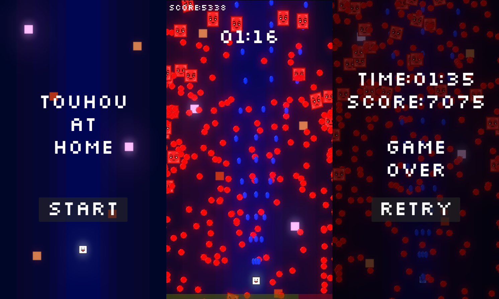

# Touhou At Home

## Screenshots

## Download Link
**Note: The game only works for Windows devices.**

If you're interested in trying out the game, you can view the uploaded google drive and download it [here](https://drive.google.com/drive/folders/1fp3bI1nkeYLZ0EvSSt0vL8SYsCAbGUmP?usp=sharing).

## About
Touhou at home is a bullet hell game where you must survive as long as you can while eliminating as many enemies to score points. I created this game in order to learn how to utilize Godot.

## Controls
W or Up Arrow: Move Up

A or Left Arrow: Move Left

D or Right Arrow: Move Right

S or Down Arrow: Move Down

Enter: Start Game (In Menu)

## Tools Used
- Godot Version 4.2.2
- Aseprite Version 1.3.7-x64

## Assets
**Art**
- Font - *Silkscreen* by Jason Kottke ([Source](https://www.fontsquirrel.com/fonts/Silkscreen))
- Sprites and Icon drawn by me with *Aseprite*

**Sound Effects**
- Enemy Killed SFX: *Pokémon Ruby/Sapphire/Emerald* - Pokémon Fainting
- Enemy Shoot SFX: *Undertale* - Dust Swoosh
- Game Over SFX: *Pokémon Heart Gold and Soul Silver (2009)* - Goldenrod Game Corner (Retire)
- Player Damaged SFX: *UnderTale* - Damage Taken
- Player Shoot SFX: Laser Shot ([Source](https://www.myinstants.com/en/instant/laser-shot-14018/))

**Music**
- Game Over Music: *Pokémon Heart Gold and Soul Silver (2009)* - Pallet Town
- In Game Music: *Pokémon Ranger (2006)* - Wild Pokémon Battle
- Menu Music: *Bag Raiders (2009)* - Shooting Stars
